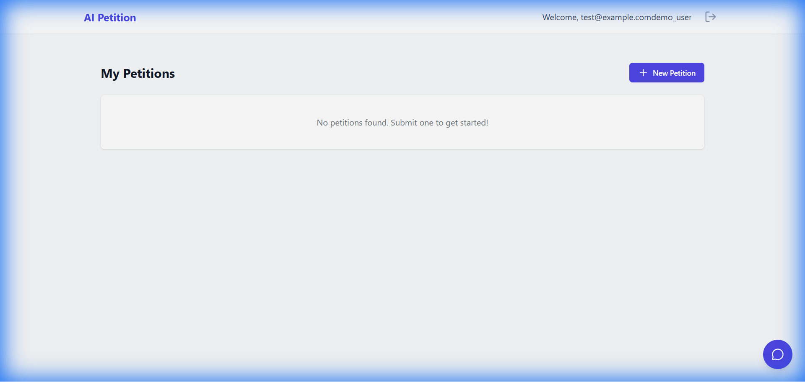
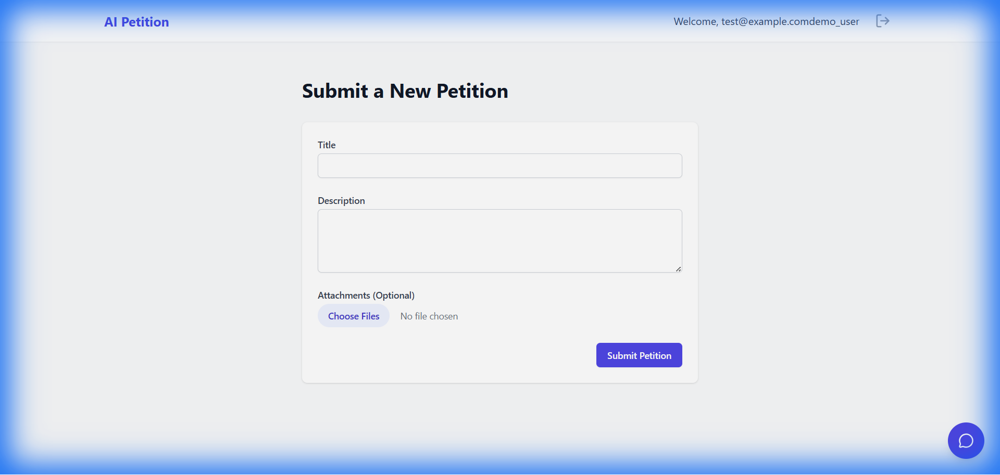
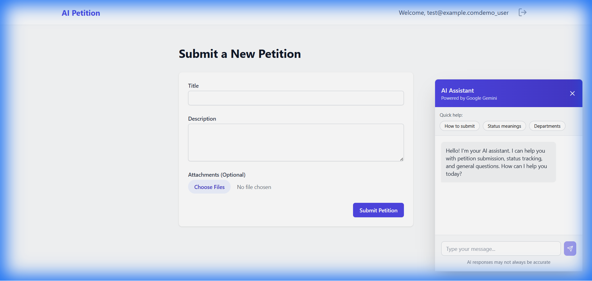

# 🤖 AI Petition & Grievance Management System

An intelligent petition management platform powered by Google Gemini AI, featuring automatic classification, duplicate detection, and real-time status tracking.

[](https://www.python.org/)
[](https://www.djangoproject.com/)
[](https://reactjs.org/)
[](https://www.typescriptlang.org/)
[](LICENSE)

## 🌟 Features

### 🤖 AI-Powered Intelligence
- **Smart Classification**: Automatically categorizes petitions into 8 departments using Google Gemini 2.0 Flash
- **Urgency Detection**: AI predicts urgency levels (LOW, MEDIUM, HIGH, CRITICAL)
- **Duplicate Detection**: ChromaDB vector similarity prevents duplicate submissions
- **AI Chatbot**: Real-time assistance powered by Gemini

### 📊 Complete Workflow Management
- **Status Tracking**: Full lifecycle from submission to resolution
- **SLA Monitoring**: Automated reminders via Celery Beat
- **Email Notifications**: Real-time updates to citizens
- **File Uploads**: Support for multiple attachments

### 🎨 Modern User Interface
- **Citizen Portal**: Submit petitions, track status, chat with AI
- **Officer Portal**: Manage assigned petitions, update status
- **Admin Dashboard**: Analytics, department management, overview

### 🗄️ Hybrid Database Architecture
- **SQLite**: Django internals (sessions, admin)
- **MongoDB**: Application data with automatic sync
- **ChromaDB**: Vector embeddings for similarity search

---

## 🚀 Quick Start

### Prerequisites
- Python 3.12+
- Node.js 18+
- MongoDB (optional, for MongoDB features)
- Google Gemini API Key

### 1️⃣ Clone Repository
```bash
git clone https://github.com/madhan-200/AI-Petition-Management-.git
cd AI-Petition-Management-
```

### 2️⃣ Backend Setup
```bash
cd backend

# Create virtual environment
python -m venv venv
source venv/bin/activate  # On Windows: venv\Scripts\activate

# Install dependencies
pip install -r requirements.txt

# Configure environment
cp .env.example .env
# Edit .env and add your GOOGLE_API_KEY

# Run migrations
python manage.py migrate

# Create superuser (optional)
python manage.py createsuperuser

# Start server
python run_waitress.py
```

Backend will run at: **http://localhost:8000**

### 3️⃣ Frontend Setup
```bash
cd frontend

# Install dependencies
npm install

# Start development server
npm run dev
```

Frontend will run at: **http://localhost:5173**

---

## 🔑 Environment Variables

Create `backend/.env` file:

```env
# Google Gemini API Key (Required)
GOOGLE_API_KEY=your_google_gemini_api_key_here

# Django Settings
DEBUG=True
SECRET_KEY=your_django_secret_key_here

# Email Configuration (Optional)
EMAIL_HOST_USER=your_email@gmail.com
EMAIL_HOST_PASSWORD=your_app_password

# MongoDB (Optional)
MONGODB_URI=mongodb://localhost:27017

# Redis (Optional - for Celery)
CELERY_BROKER_URL=redis://localhost:6379/0
```

**Get Google Gemini API Key:** [Google AI Studio](https://makersuite.google.com/app/apikey)

---

## 📁 Project Structure

```
AI-Petition-Management-/
├── backend/                    # Django Backend
│   ├── ai_agent/              # AI services (Gemini, ChromaDB)
│   │   ├── services.py        # Classification & urgency prediction
│   │   ├── chatbot.py         # AI chatbot service
│   │   └── duplicate_detection.py  # ChromaDB integration
│   ├── config/                # Django settings
│   │   ├── settings.py        # Main configuration
│   │   ├── mongodb.py         # MongoDB connection
│   │   └── celery.py          # Celery configuration
│   ├── users/                 # User management
│   │   ├── models.py          # User model
│   │   ├── serializers.py     # API serializers
│   │   └── mongo_repository.py # MongoDB user operations
│   ├── petitions/             # Petition management
│   │   ├── models.py          # Petition, Department, SLA models
│   │   ├── views.py           # API endpoints
│   │   ├── tasks.py           # Celery tasks (SLA monitoring)
│   │   └── mongo_repository.py # MongoDB petition operations
│   ├── manage.py              # Django management
│   ├── run_waitress.py        # Production server
│   └── requirements.txt       # Python dependencies
│
├── frontend/                   # React Frontend
│   ├── src/
│   │   ├── components/        # Reusable components
│   │   │   ├── Chatbot.tsx    # AI chatbot widget
│   │   │   ├── Navbar.tsx     # Navigation
│   │   │   └── Timeline.tsx   # Status timeline
│   │   ├── pages/             # Page components
│   │   │   ├── Login.tsx      # Login page
│   │   │   ├── Signup.tsx     # Registration
│   │   │   ├── Dashboard.tsx  # Citizen dashboard
│   │   │   ├── SubmitPetition.tsx  # Petition form
│   │   │   ├── OfficerDashboard.tsx # Officer portal
│   │   │   └── AdminDashboard.tsx   # Admin portal
│   │   ├── store/             # Redux state management
│   │   │   ├── authSlice.ts   # Authentication state
│   │   │   └── store.ts       # Redux store
│   │   ├── services/          # API services
│   │   │   └── api.ts         # Axios configuration
│   │   └── App.tsx            # Main app component
│   ├── package.json           # Node dependencies
│   └── vite.config.ts         # Vite configuration
│
├── .gitignore                 # Git ignore rules
├── README.md                  # This file
└── SECURITY_SETUP.md          # Security guidelines
```

---

## 🎯 API Endpoints

### Authentication
- `POST /api/users/register/` - User registration
- `POST /api/users/login/` - Login (returns JWT tokens)

### Petitions
- `GET /api/petitions/` - List petitions (filtered by role)
- `POST /api/petitions/` - Create petition (with AI classification)
- `GET /api/petitions/{id}/` - Get petition details
- `PUT /api/petitions/{id}/` - Update petition status
- `DELETE /api/petitions/{id}/` - Delete petition

### AI Services
- `POST /api/ai/chat/` - Chatbot conversation
- `GET /api/ai/chat/help/` - Get help topics

---

## 🧪 Testing

### Backend Tests
```bash
cd backend

# Test MongoDB integration
python test_mongodb.py

# Test complete system
python test_complete_system.py

# Run Django tests
python manage.py test
```

### Frontend Tests
```bash
cd frontend

# Run tests
npm test

# Build for production
npm run build
```

---

## 🛠️ Technology Stack

### Backend
- **Framework**: Django 5.2.8, Django REST Framework
- **AI/ML**: Google Gemini 2.0 Flash, LangChain, ChromaDB
- **Database**: SQLite, MongoDB (pymongo)
- **Task Queue**: Celery, Redis
- **Server**: Waitress WSGI
- **Authentication**: JWT (djangorestframework-simplejwt)

### Frontend
- **Framework**: React 18, TypeScript
- **State Management**: Redux Toolkit
- **Styling**: TailwindCSS
- **Build Tool**: Vite
- **HTTP Client**: Axios
- **Routing**: React Router v6

### AI & ML
- **LLM**: Google Gemini 2.0 Flash
- **Embeddings**: Gemini embedding-001
- **Vector DB**: ChromaDB
- **Framework**: LangChain

---

## 🎨 Screenshots

### Citizen Dashboard

*Track your petitions with real-time status updates and timeline visualization*

### Petition Submission Form

*Submit petitions with AI-powered classification and file upload support*

### AI Chatbot Assistant

*Get instant help from Gemini-powered AI assistant*

---

## 🔒 Security

- ✅ JWT authentication with token refresh
- ✅ Password hashing (Django's PBKDF2)
- ✅ CORS configuration
- ✅ Environment variable protection
- ✅ `.gitignore` for sensitive files
- ✅ SQL injection prevention (Django ORM)
- ✅ XSS protection

**See [SECURITY_SETUP.md](SECURITY_SETUP.md) for detailed security guidelines.**

---

## 📊 Database Schema

### User Model
- `id`, `username`, `email`, `password`, `role` (CITIZEN/OFFICER/ADMIN)
- `is_active`, `is_staff`, `date_joined`

### Petition Model
- `id`, `title`, `description`, `citizen`, `department`
- `status` (SUBMITTED/UNDER_REVIEW/ASSIGNED/IN_PROGRESS/RESOLVED/REJECTED/CLOSED)
- `urgency` (LOW/MEDIUM/HIGH/CRITICAL)
- `is_duplicate`, `created_at`, `updated_at`

### Department Model
- `id`, `name`, `description`, `sla_hours`

### Attachment Model
- `id`, `petition`, `file`, `uploaded_at`

---

## 🚀 Deployment

### Option 1: Heroku
```bash
heroku create ai-petition-system
git push heroku main
heroku run python manage.py migrate
```

### Option 2: Docker
```bash
docker-compose up -d
```

### Option 3: Manual Deployment
1. Set up production database (PostgreSQL/MongoDB Atlas)
2. Configure email service (SMTP, SendGrid)
3. Set up Redis for Celery
4. Build frontend: `npm run build`
5. Collect static files: `python manage.py collectstatic`
6. Run with Gunicorn/Waitress

**See deployment guides in `docs/` folder.**

---

## 🤝 Contributing

Contributions are welcome! Please follow these steps:

1. Fork the repository
2. Create a feature branch (`git checkout -b feature/AmazingFeature`)
3. Commit your changes (`git commit -m 'Add some AmazingFeature'`)
4. Push to the branch (`git push origin feature/AmazingFeature`)
5. Open a Pull Request

---

## 📝 License

This project is licensed under the MIT License - see the [LICENSE](LICENSE) file for details.

---

## 👥 Authors

- **Madhan** - *Initial work* - [madhan-200](https://github.com/madhan-200)

---

## 🙏 Acknowledgments

- [Google Gemini AI](https://ai.google.dev/) for AI capabilities
- [ChromaDB](https://www.trychroma.com/) for vector similarity search
- [Django](https://www.djangoproject.com/) & [React](https://reactjs.org/) communities
- [TailwindCSS](https://tailwindcss.com/) for beautiful styling

---

## 📧 Support

For support, email: support@aipetition.com or open an issue on GitHub.

---

## 🗺️ Roadmap

- [ ] SMS notifications (Twilio integration)
- [ ] Mobile app (React Native)
- [ ] Advanced analytics dashboard
- [ ] Multi-language support
- [ ] LangGraph multi-agent workflows
- [ ] Real-time WebSocket updates
- [ ] PDF report generation
- [ ] API rate limiting

---

## ⭐ Star History

If you find this project useful, please consider giving it a star! ⭐

---

**Made with ❤️ using Google Gemini AI**

---

## 📞 Quick Links

- [Documentation](docs/)
- [API Reference](docs/api.md)
- [Deployment Guide](docs/deployment.md)
- [Contributing Guidelines](CONTRIBUTING.md)
- [Security Policy](SECURITY_SETUP.md)
- [Changelog](CHANGELOG.md)

---

*Last Updated: November 23, 2025*
